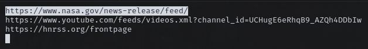

# Nirss

A rss feed dowloader and manager with a tui and cli interface.

## Nirss is a library

Use nirss as a library for your own rss projects

```nim
import nirss

# config is saved to '~/.config/nirss' 
withConfig(cfg):
    ## Add a new feed to the config and downloads the feed
    cfg.addFeed(meta, "<example@rss.xml>", update = true)
    echo(cfg.feeds())
```

## Nirss is a cli

`nim r src/app/cli --add:"<example@rss.xml>"`

## Nirss is a tui

`nim r src/app/app`


